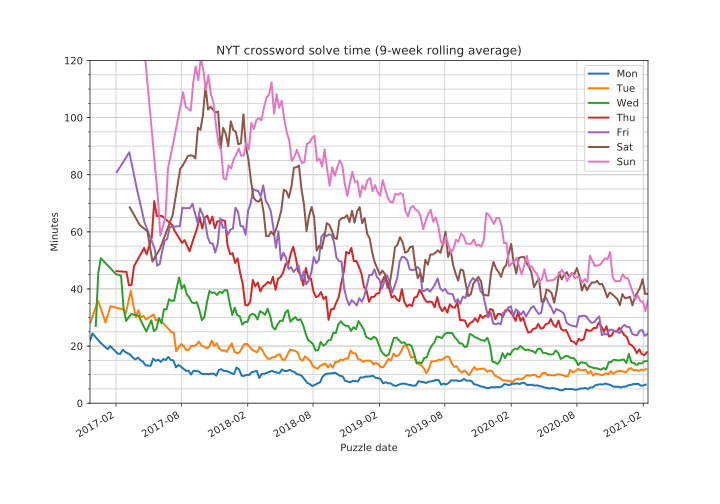

# Scraping NYT crossword stats ⬛⬜⬜⬜⬜⬛

When I first subscribed to the _New York Times_ crossword in January 2017, I could solve some Monday
puzzles and maybe the occasional Tuesday. Over time, I slowly got better at noticing the common
patterns and picked up enough [crosswordese](https://en.wikipedia.org/wiki/Crosswordese) to be able
to finish it fairly consistently. As of February 2021, I've now maintained a daily streak stretching
back 3+ years to August 2017 (knock on wood...).

The NYT crossword app exposes some solve time statistics like all-time average and fastest time,
both broken out day. But there is no good way to see how much you have improved over time. You can
open each puzzle in the archive individually and see your times, but there aren't any overview plots
or officially-sanctioned developer APIs to fetch your data. Luckily, all puzzle stats are fetched
via client-side Javascript, making it easy enough to scrape the data.



Some observations:

* The crossword clues _generally_ get harder over the course of the week, peaking in difficulty on
Saturday, and the correlation with solve times shows up pretty clearly in the solve times.
* The clues of Sunday puzzles are roughly at a Thursday or Friday difficulty level, but the grid is
extra-large, so it's usually the slowest day.
* Thursdays and Sundays usually have some sort of theme and/or trick, which usually added extra
difficulty, especially early on when I wasn't as familiar with the usual patterns that constructors
follow.

Caveats:

* Puzzles are currently plotted against the date they were released. This is accurate for puzzles
during my current streak (i.e. after August 2017), but I did return to some older puzzles that I
couldn't initially solve, which would skew the early data a bit. The NYT does store the timestamp
when a puzzle is solved, so you could use that to discard those data points.
* I didn't count any puzzles that I didn't finish or that I used the "check" or "reveal" assists on,
so there's some survivorship bias. Again, this only affects the early data.

## Scraping the data

Thanks to fun [licensing issues](https://opensource.google/docs/), I can't (yet) share the actual
code used to scrape or plot the data, but there's not much to it beyond hitting some REST APIs and
then figuring out what data to plot. If you choose to replicate this, be nice, use reasonable rate
limits, etc. I'm not responsible for anything that happens to your account.

1. Each puzzle is assigned a numerical id. Before we can fetch the stats for a given puzzle, we need
to know that id. To find it, send a GET request as below, specifying `{start_date}` and `{end_date}`
in YYYY-MM-DD format ([ISO 8601](https://xkcd.com/1179)). The server response is limited to 100
puzzles and can be limited further by adding a `limit` parameter.

```sh
curl 'https://nyt-games-prd.appspot.com/svc/crosswords/v3/36569100/puzzles.json?publish_type=daily&date_start={start_date}&date_end={end_date}' -H 'accept: application/json'
```

2. To fetch solve stats for a given puzzle, send a GET request as below, replacing `{id}` with the
puzzle id. This API requires a NYT crossword subscription. `{subscription_header}` can be found by
snooping on outgoing HTTP requests via Chrome/Firefox developer tools while opening a NYT crossword
in your browser. Alternatively, you can supposedly extract your session cookie from your browser and
send that instead (see linked reddit post below), but I haven't tried it myself.

```sh
curl 'https://nyt-games-prd.appspot.com/svc/crosswords/v6/game/{id}.json' -H 'accept: application/json' -H 'nyt-s: {subscription_header}'
```

4. Check out the `calcs` and `firsts` field of this response to get information like solve duration,
when the puzzle was solved, and whether any assists were used.

5. Rinse and repeat, collecting data for the dates of interest.

## References

* [Relevant Reddit post](https://www.reddit.com/r/crossword/comments/dqtnca/my_automatic_nyt_crossword_downloading_script): for figuring out how to find the right APIs to hit
* [Rex Parker does the NY Times crossword](https://rexwordpuzzle.blogspot.com): grumpy old man
